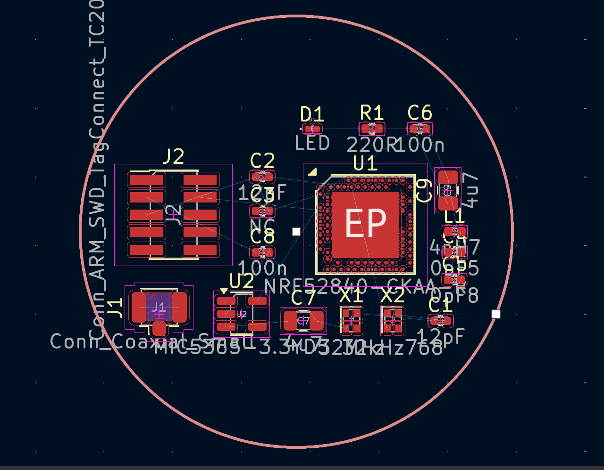
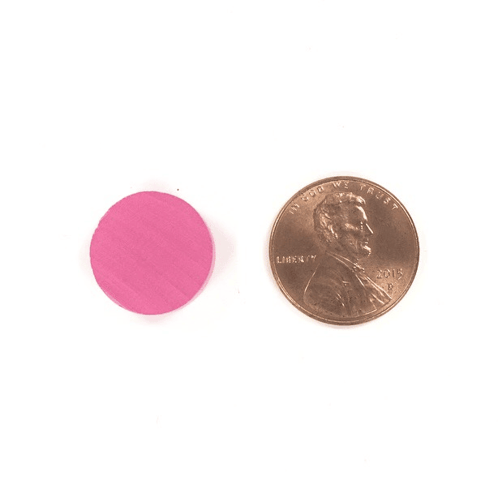

# smartclip
Intelligent wearable hairclip. A testbed for wearable computing such as health monitoring devices. Supports Tock OS and the Thread protocol.

* low cost ($5)
* low power (3µA)
  * up to 10 years of battery life
* operates without internet access
* open source foundation for secure medical devices

> 4. Medical Device Innovation and Assistive Technologies
> - Pathway 1: Improve existing medical devices and assistive technologies (e.g., enhancing usability and sustainability, improving affordability of assistive devices).
> - Pathway 2: Design new medical devices and assistive solutions (e.g., innovative devices addressing unmet healthcare needs, new assistive technologies for specific disabilities).

