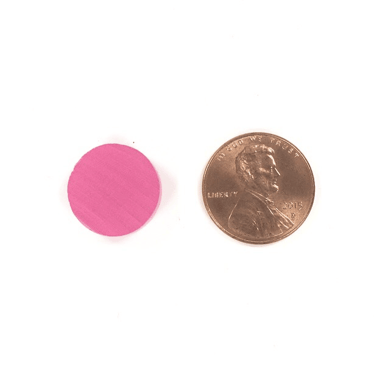
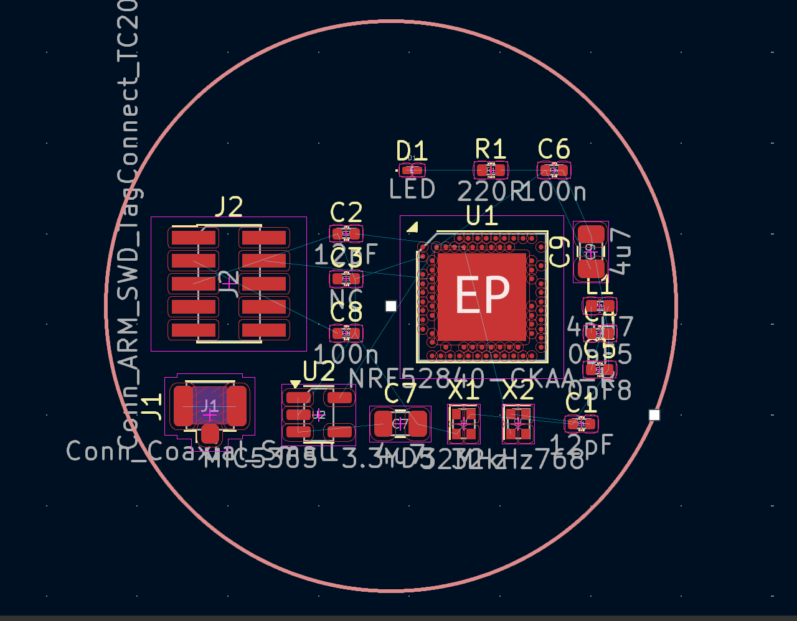

<!-- 
cost of malware to UCSD
because devices are insecure and on the internet
- like insulin pumps
this is in Rust
- white house
- google
this is smart dust which can collect data, patient location using mesh networking without internet

round coin cell has x years of battery life
cost of this is x
open source and free

wearables allow for more data. and better patient outcomes.
thread can help patients even in remote areas

patient tracking low power amputees

 -->

<!-- _header: "" -->
<!-- _paginate: hide -->

# Secure Dust: reliable healthcare devices

## Low Cost. Low Power. Secure.

## **Samir Rashid**
<!-- ### Open Source Firmware Conference, September 3, 2024 -->

         

---

    
    

---

---

---

---

---

# Security is **critical** and **urgent**.

---

> ## Chronic diseases account for 73% of deaths worldwide

 

> ## An estimated 36% of all allocated health care expenditure is directed at supporting individuals with chronic diseases

- [NIH](https://www.ncbi.nlm.nih.gov/pmc/articles/PMC9288104/)

---

# Long term illnesses require long term monitoring

---

# Long term illnesses require **secure** long term monitoring

---

# Secure Dust: low-cost, low-power, secure wearables

---

# Key Features:
1) **Real-time Monitoring**
   - Seamlessly connects to smartphones and health apps.
   - Allows for easy data sharing with healthcare providers.
   - Customizable alerts.
2) **Long Battery Life**
   - Energy-efficient design ensures extended usage between charges.
3) **Low Cost**
    - Off the shelf parts and optimized design.
4) **Secure Software**
    - Foundations for complying with future FDA regulations.

---

---

---

---

---

# Tock OS
* embedded operating system
* used to secure millions of consumer devices

---

---

---

# Summary

---

---

# Game changer for **Elder Care** and **Chronic Conditions**

---

# Summary

* ## low cost ($5)
* ## low power (3µA)
  * ## up to 10 years of battery life
* ## operates without internet access
* ## open source foundation for secure medical devices

---

# Thanks! Questions?